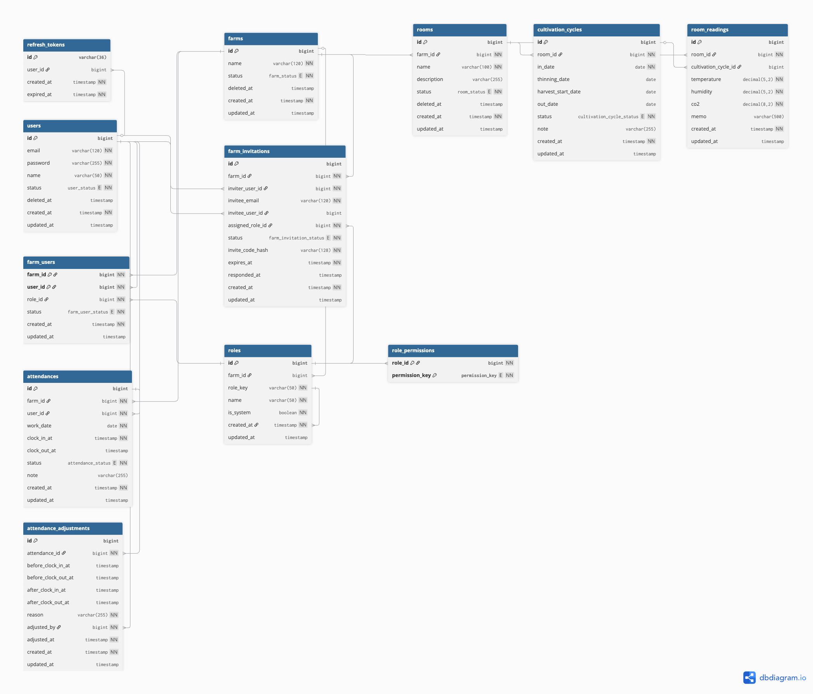

# FarmFlow API

실제 새송이 버섯 농장 운영 흐름을 소프트웨어로 옮기기 위해 개발 중인 농장 관리 백엔드 프로젝트입니다.  
부모님이 운영하는 농장에서 바로 사용할 수 있는 시스템을 목표로, 농장 멤버십과 권한 관리부터 생육동 운영, 재배 주기 추적, 환경 기록, 출퇴근 관리까지 하나의 도메인으로 통합하고 있습니다.

## 프로젝트 소개

FarmFlow는 일반적인 CRUD 프로젝트보다 "현장에서 실제로 쓰일 수 있는가"에 더 집중한 백엔드입니다.

- 농장 단위 멤버십 및 권한 관리
- 생육동(Room) 관리
- `CultivationCycle` 기반 생육 사이클 추적
- 온도, 습도, CO2 중심 환경 기록 관리
- 초대 기반 협업 흐름
- 출퇴근 및 근태 수정 이력 관리
- JWT + Refresh Token 기반 인증 구조

## 왜 만들고 있는가

새송이 버섯 농장은 비교적 명확한 생산 흐름을 가집니다.

1. 생육동(Room)이 존재합니다.
2. 종균을 입상하면 생육이 시작됩니다.
3. 일정 시점에 솎기(thinning)를 진행합니다.
4. 이후 수확(harvest)을 진행합니다.
5. 퇴상(out-date)으로 하나의 사이클을 마무리합니다.

FarmFlow는 이 흐름을 `CultivationCycle`이라는 명시적 도메인 모델로 관리합니다.  
즉, 단순히 데이터를 저장하는 서비스가 아니라, 실제 농장 운영 프로세스를 API와 데이터 모델로 표현하는 데 초점을 맞추고 있습니다.

## 핵심 기능

### 인증 / 사용자

- 회원가입
- 로그인
- Refresh Token 기반 토큰 재발급
- JWT 인증/인가
- 사용자 단건 조회

### 농장 / 멤버십 / 권한

- 농장 등록, 목록 조회, 상세 조회, 수정, 삭제
- 농장 멤버 조회
- 농장 멤버 역할 변경
- 농장 멤버 상태 변경(제거)
- 농장 단위 RBAC(Role, RolePermission) 관리
- 시스템 기본 역할 및 농장 커스텀 역할 구조 지원

### 초대 / 협업

- 농장 멤버 초대 생성
- 초대 수락
- 초대 목록 조회
- 초대 취소

### 운영 관리

- 생육동(Room) 등록, 조회, 수정, 삭제
- 생육 사이클 등록
- 생육 사이클 목록/단건/활성 사이클 조회
- 솎기 / 수확 시작 / 퇴상 상태 전이 처리
- 환경 기록 등록, 조회, 수정, 삭제
- 환경 기록 조건 조회(농장, 생육동, 기간)
- 출근 / 퇴근 처리
- 개인 출퇴근 조회
- 관리자용 출퇴근 조회 및 수정
- 출퇴근 수정 이력 관리

## 설계 포인트

### 1. 농장 단위 멤버십 모델

FarmFlow는 "사용자 1명 = 농장 1개" 구조가 아니라, 한 사용자가 여러 농장에 소속될 수 있도록 설계했습니다.

- `User` 와 `Farm` 은 N:M 관계
- 연결 엔티티로 `FarmUser` 사용
- 권한은 전역이 아니라 농장 컨텍스트 안에서 해석

이 구조를 통해 가족 농장, 공동 운영, 향후 다중 농장 확장까지 자연스럽게 대응할 수 있습니다.

### 2. 농장 단위 RBAC

권한은 단순한 전역 `ADMIN`, `USER` 방식이 아니라 농장 안에서의 역할로 분리했습니다.

- 어떤 농장에서는 `OWNER`
- 다른 농장에서는 `WORKER`

처럼 동작할 수 있도록 모델링했습니다.  
또한 시스템 기본 역할 외에도 커스텀 역할을 확장할 수 있도록 `Role`, `RolePermission` 구조를 도입했습니다.

### 3. 실제 운영 흐름 중심 도메인 모델링

프로젝트의 핵심은 생육동마다 반복되는 생산 사이클을 추적하는 것입니다.

- 생육동이 있고
- 특정 날짜에 입상되고
- 이후 솎기, 수확, 퇴상 단계가 진행되며
- 그 과정에서 환경 기록과 근태 데이터가 누적됩니다

이 흐름을 `Room`, `CultivationCycle`, `RoomReading`, `Attendance`가 연결된 구조로 설계했습니다.

## ERD

Farm 중심으로 사용자, 권한, 초대, 근태, 재배 주기, 환경 기록, 인증 구조를 함께 관리하도록 설계했습니다.



## 기술 스택

- Java 17
- Spring Boot 4.0.3
- Spring Data JPA
- Spring Security
- JWT
- MySQL 8
- Docker / Docker Compose
- Springdoc OpenAPI (Swagger UI)
- Lombok

## API 구조

모든 REST API는 아래 prefix를 사용합니다.

```text
/api/v1
```

예시:

- `POST /api/v1/auth/register`
- `POST /api/v1/auth/login`
- `POST /api/v1/auth/refresh`
- `GET /api/v1/farms`
- `POST /api/v1/farms/{farmId}/invitations`
- `POST /api/v1/{farmId}/rooms/{roomId}/cultivation-cycles`

## 로컬 실행 방법

### 1. MySQL 실행

로컬 개발 환경에서는 Docker Compose를 사용합니다.

```bash
docker compose up -d
```

기본 개발 설정:

- Port: `33065`
- Database: `farm-flow`
- Username: `root`

### 2. 애플리케이션 설정

`src/main/resources/application.yml` 기준으로 아래 설정이 필요합니다.

- MySQL datasource
- JWT secret
- SMTP mail 설정
- Refresh Token cookie 설정
- CORS 허용 origin 설정

실제 운영이나 협업 환경에서는 민감한 설정을 환경변수 또는 별도 설정 파일로 분리하는 방향을 고려하고 있습니다.

### 3. 서버 실행

```bash
./gradlew bootRun
```

기본 주소:

```text
http://localhost:4000
```

### 4. API 문서 확인

[Swagger UI](http://localhost:4000/swagger-ui/index.html)

## 현재까지 구현하며 중요하게 본 점

- 현실 도메인을 기준으로 엔티티를 분리하고 관계를 설계하는 것
- 인증, 권한, 초대 흐름을 단순 로그인 기능이 아니라 협업 구조로 연결하는 것
- 생육 사이클처럼 상태 전이가 중요한 도메인을 API로 안전하게 표현하는 것
- 운영 데이터를 단순 로그가 아니라 추후 의사결정에 활용 가능한 구조로 남기는 것

## 앞으로 확장하고 싶은 방향

- PWA 프론트엔드와의 실제 연동
- 작업 기록, 급여/정산 보조 기능 확장
- 환경 데이터 시각화 및 조회 경험 개선
- 테스트 코드 및 API 문서 자동화 강화
- 운영 데이터를 기반으로 한 농장 관리 보조 기능 추가

## 한 줄 요약

FarmFlow는 새송이 버섯 농장의 실제 운영 흐름을 기준으로 설계한 Spring Boot 기반 농장 관리 백엔드 프로젝트입니다.
